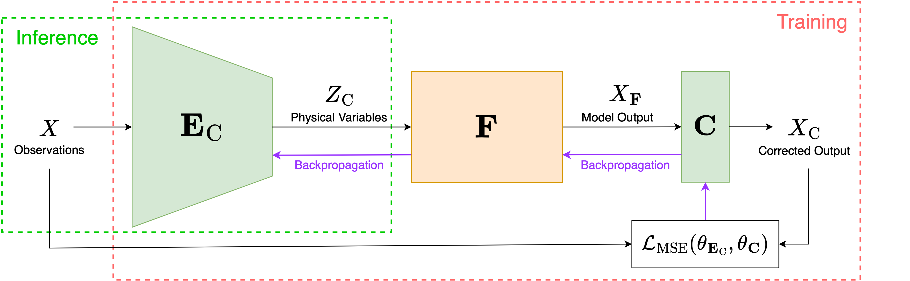

# MAGIC: Modular Auto-encoder for Generalisable Model Inversion with Bias Corrections
Scientists often model physical processes to understand the natural world and uncover the causation behind observations. Due to unavoidable simplification, discrepancies often arise between model predictions and actual observations, in the form of systematic biases, whose impact varies with model completeness. Classical model inversion methods such as Bayesian inference or regressive neural networks tend either to overlook biases or make assumptions about their nature during data preprocessing, potentially leading to implausible results. Inspired by recent work in inverse graphics, we replace the decoder stage of a standard autoencoder with a physical model followed by a bias-correction layer. This generalisable approach simultaneously inverts the model and corrects its biases in an end-to-end manner without making strong assumptions about the nature of the biases. We demonstrate the effectiveness of our approach using two physical models from disparate domains: a complex radiative transfer model from remote sensing; and a volcanic deformation model from geodesy. Our method matches or surpasses results from classical approaches without requiring biases to be explicitly filtered out, suggesting an effective pathway for understanding the causation of various physical processes.

## Approach
Learning the inverse, end-to-end, in an encoder that includes correction layers $\mathbf{C}$.


## Requirements
To install requirements:
```
pip3 install -r requirements.txt
```

## Training
To train the models in the paper, run the following commands:
```
cd MAGIC # change working directory to MAGIC
./run_train.sh
```
Alternatively, a specific model e.g. $\mathbf{M}_{\mathrm{C, RTM}}$ can be trained using this command:
```
python3 train.py --config configs/AE_RTM_C.json
```
Please see run_train.sh for more examples. 

## Evaluation
To evaluate the pretrained models, run the following commands:
```
cd MAGIC # change working directory to MAGIC
./run_eval.sh
```
Alternatively, a specific model e.g. $\mathbf{M}_{\mathrm{C, RTM}}$ can be evaluated using this command:
```
python3 test_AE_RTM.py \
         --config pretrained/AE_RTM_C/config.json \
         --resume pretrained/AE_RTM_C/model_best.pth
```
This will evaluate the MSE loss of the pretrained model on the test set and save the evaluation results for further analysis. Please see run_eval.sh for more examples. 